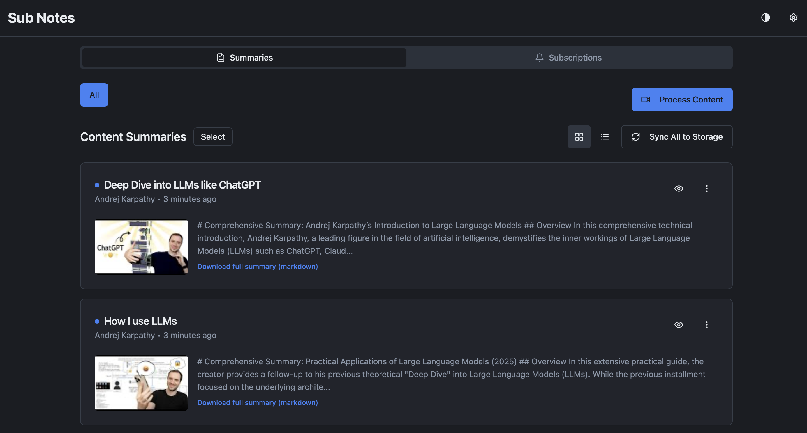

# Sub Notes

AI-powered content summaries for YouTube videos and Substack posts. Self-hosted, single-user, runs entirely in Docker.

## Features

- **YouTube** — Subscribe to channels/feeds or process individual URLs
- **AI Summaries** — Detailed markdown summaries via Gemini 2.0 Flash
- **Automatic Tagging** — AI categorization with 30+ topic tags
- **Token Usage Tracking** — Monitor API costs per summary
- **Obsidian Sync** — Auto-save summaries to a local Obsidian vault
- **Card/List view** — Toggle between views, persisted per browser



## Architecture

```
docker-compose.yml
├── pocketbase   :7070   SQLite database + admin UI (/_/)
├── backend      :3333   Bun HTTP server (API + AI processing)
└── frontend     :9090   React SPA (nginx, proxies /api/ to backend)
```

### Tech Stack

**Frontend**: React, TypeScript, Vite, shadcn/ui, Tailwind CSS, TanStack Query, React Router

**Backend**: Bun, TypeScript — handles YouTube metadata, transcript fetching, Gemini API calls, Obsidian file writes

**Database**: PocketBase (SQLite) — collections: `subscriptions`, `content_summaries`, `tags`, `content_summary_tags`, `settings`

**AI**: Google Gemini 2.0 Flash via direct REST API

## Quick Start

```sh
# 1. Copy and fill in your keys
cp .env.example .env

# 2. Start everything
docker compose up --build

# App:       http://localhost:9090
# PocketBase admin: http://localhost:7070/_/
```

## Environment Variables

```env
# PocketBase admin credentials
PB_ADMIN_EMAIL=admin@localhost.local
PB_ADMIN_PASSWORD=changeme_strong_password

# API Keys (required)
YOUTUBE_API_KEY=AIza...
GEMINI_API_KEY=AIza...

# Obsidian vault sync (optional)
OBSIDIAN_VAULT_PATH=/path/to/your/vault
OBSIDIAN_SUBFOLDER=sub-notes
```

## Backend API

| Endpoint | Method | Purpose |
|----------|--------|---------|
| `/api/subscriptions` | GET, POST | List / add subscriptions |
| `/api/subscriptions/:id` | PATCH, DELETE | Update / remove subscription |
| `/api/process` | POST | Queue URL for summary generation |
| `/api/generate-summary/:id` | POST | Run generation for a pending summary |
| `/api/sync/obsidian/:id` | POST | Write summary markdown to vault |
| `/api/settings` | GET, PUT | Read / update app settings |
| `/health` | GET | Health check |

## Development

```sh
# Install frontend dependencies
bun i

# Frontend dev server (port 8080, connects to Docker backend)
bun run dev

# Lint
bun run lint

# Build frontend for production
bun run build
```

Run PocketBase and backend via Docker while developing the frontend locally:

```sh
docker compose up pocketbase backend
bun run dev
```

## Database Schema

**PocketBase collections:**

- `subscriptions` — YouTube channels and Substack feeds being tracked
- `content_summaries` — Processed content with markdown summaries, token usage, status
- `tags` — 30 predefined category tags
- `content_summary_tags` — Many-to-many with confidence scores
- `settings` — Key-value app settings (Obsidian config, etc.)

**`content_summaries.status`**: `pending` → `processing` → `completed` | `failed`

**`content_summaries.metadata`**: JSONB with `token_usage` (input, output, total tokens, estimated cost)

## Project Structure

```
sub-notes/
├── src/                    # React frontend
│   ├── components/         # UI components
│   ├── pages/              # Dashboard, Settings
│   ├── lib/                # pocketbase.ts, api.ts
│   ├── hooks/              # Custom React hooks
│   └── types/              # TypeScript interfaces
├── backend/
│   └── src/
│       ├── index.ts        # Bun.serve() router
│       ├── routes/         # subscriptions, process, generateSummary, obsidian, settings
│       └── lib/            # pocketbase, youtube, gemini, transcript, obsidian, substack
├── pocketbase/
│   ├── Dockerfile
│   ├── entrypoint.sh
│   └── migrations/         # 001_init.js — creates all collections
├── nginx/
│   └── nginx.conf          # SPA fallback + /api/ proxy
├── Dockerfile.frontend     # Multi-stage: bun build → nginx
├── docker-compose.yml
└── .env.example
```

## Data Backup

Docker named volumes (`sub-notes_pocketbase_data`) are opaque to most backup tools. Export them to a regular directory so Time Machine or any file-based backup picks them up automatically.

**One-off backup:**
```sh
docker run --rm \
  -v sub-notes_pocketbase_data:/data:ro \
  -v ~/backups/sub-notes:/backup \
  alpine tar czf /backup/pb-$(date +%Y%m%d-%H%M%S).tar.gz -C /data .
```

**Cron job (nightly at 2 AM)** — add via `crontab -e`:
```cron
0 2 * * * docker run --rm -v sub-notes_pocketbase_data:/data:ro -v ~/backups/sub-notes:/backup alpine tar czf /backup/pb-$(date +\%Y\%m\%d).tar.gz -C /data . && find ~/backups/sub-notes -name "*.tar.gz" -mtime +30 -delete
```

**Restore:**
```sh
docker run --rm \
  -v sub-notes_pocketbase_data:/data \
  -v ~/backups/sub-notes:/backup \
  alpine tar xzf /backup/pb-20260401.tar.gz -C /data
```

PocketBase also exposes a built-in backup endpoint (`POST /api/backups` from the admin UI at `http://localhost:7070/_/`) which writes zips into `/pb_data/backups/` — these are included in the tar above.

## License

MIT — see [LICENSE](LICENSE).
